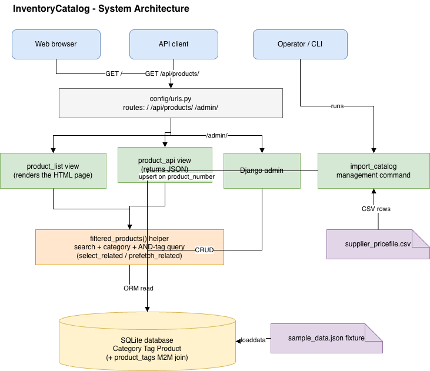

# Product Catalog

A Django product catalog with search and filtering. You can search by name or
description, filter by category, filter by one or more tags (a product has to have
all the tags you pick), and use those together.

> Beyond what the assignment required, I also added a read-only JSON endpoint and a
> CSV import command. Those two are extras, not part of the spec.

## Live demo

It's running at https://khusdeep899.pythonanywhere.com/. The admin is at
https://khusdeep899.pythonanywhere.com/admin/, log in with `admin` / `admin12345`.
It has the same sample data that ships in this repo.

## Architecture



## Stack

- Python 3.12
- Django 5.2
- SQLite

## Setup

```bash
# clone
git clone https://github.com/Khushdeep899/InventoryCatalog.git
cd InventoryCatalog

# virtualenv
python3.12 -m venv venv
source venv/bin/activate          # Windows: venv\Scripts\activate

# install
pip install -r requirements.txt

# database, sample data, and a test admin login
python manage.py migrate
python manage.py loaddata sample_data admin_user
```

Run it:

```bash
python manage.py runserver
```

- App: http://127.0.0.1:8000/
- JSON: http://127.0.0.1:8000/api/products/
- Admin: http://127.0.0.1:8000/admin/

The `admin_user` fixture loads a test admin account, so you can log into the admin
at http://127.0.0.1:8000/admin/ straight away:

- username: `admin`
- password: `admin12345`

It's a throwaway account just for reviewing this project. To make your own instead,
run `python manage.py createsuperuser`.

## Tests

```bash
python manage.py test
```

## How the filtering works

Search is a case-insensitive match on the product name and description. Category is
an exact match. Tags use AND, so a product only shows if it has every tag you
selected.

The tag filter is the part I'd point at in a review. Instead of filtering once per
tag in a loop, it's one query that counts how many of the selected tags each product
has and keeps the ones where that count equals the number you picked. The list also
uses select_related for the category and prefetch_related for the tags, so adding
more products doesn't add more queries per product.

The HTML page and the JSON endpoint both go through the same `filtered_products()`
function, so they always filter the same way.

## Loading a supplier price file

There's a management command that reads a CSV price file into the catalog:

```bash
python manage.py import_catalog sample_data/supplier_pricefile.csv
```

It matches rows on `product_number` and updates in place, so running the same file
twice won't create duplicates. Categories and tags from the file are created if they
don't already exist (tags are pipe-separated, like `LED|Outdoor|Sale`). If a row is
broken, say the price isn't a number, it gets skipped and reported instead of
stopping the whole import, and you get a `created/updated/skipped` count at the end.

## Models

- Category: a product belongs to at most one. Deleting a category keeps its products
  but clears their category (`on_delete=SET_NULL`), so products aren't lost when a
  category goes away.
- Tag: many-to-many with products.
- Product: has a unique `product_number` (the natural key the import matches on), a
  name, a description, a price, a stock status (in stock, backorder, or
  discontinued), one category, and any number of tags.

## Sample data

The fixture at `products/fixtures/sample_data.json` has 8 categories, 15 tags, and
24 products (electrical supply parts). I entered it through the Django admin and
dumped it to the fixture so it loads in one command. `db.sqlite3` isn't committed.

## Config

Secret key, debug, and allowed hosts are read from environment variables with dev
defaults, so there's no real secret in the repo. See `.env.example`. For production
set `DJANGO_SECRET_KEY`, `DJANGO_DEBUG=False`, and `DJANGO_ALLOWED_HOSTS`.

## Notes

- Styling is minimal on purpose. The assignment says design isn't graded.
- Slugs for categories and tags come from the name automatically. Two names that
  slugify to the same string would clash on the unique constraint. I left that as is
  for the take-home, a real version would add a numeric suffix.

## AI usage

I used AI as an assistant while building this: looking things up in the Django docs,
drafting the sample product data, and help with comments and this README. 
